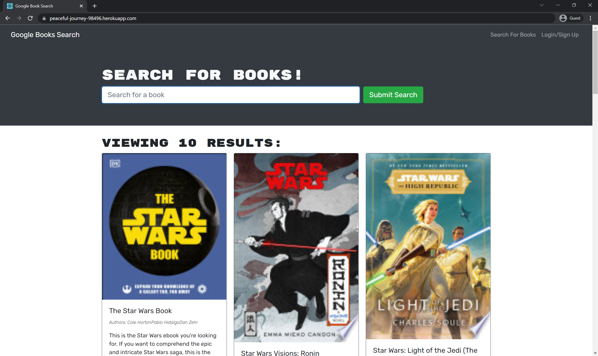

# Budget Tracker

## Description

A Google Books API search engine originally built with a RESTful API – successfully refactored as a GraphQL API built with Apollo Server.

## Table of Contents

* [User Story](#user-story)
* [Installation](#installation)
* [Screenshot](#screenshot)
* [License](#license)
* [Questions](#questions)

## User Story

AS AN avid reader  
I WANT to search for new books to read  
SO THAT I can keep a list of books to purchase  

## Installation

No installation required! Navigate to https://peaceful-journey-98496.herokuapp.com/

## Screenshot

## License

Distributed under the [Unlicense](https://choosealicense.com/licenses/unlicense/).

## Questions

* GitHub Profile: [JPDBrodeur](https://github.com/JPDBrodeur)

* Have any additional questions? You can reach me by email at [jbrodeur001@gmail.com](mailto:jbrodeur001@gmail.com).